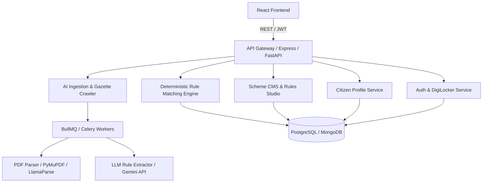

# 🇮🇳 Udyam.AI — Frontend Implementation & Backend Engineering Roadmap Report

**Project Status:** Frontend 100% Implemented & Production-Ready  
**Theme:** Premium Warm Light Theme + 3D Physics Engine + Glassmorphism  
**Stack:** Vite, React 19, Vanilla CSS Design System, Three.js (@react-three/fiber & drei), TanStack Query v5, Lucide Icons, Canvas Confetti  
**Local Dev URL:** `http://localhost:5173/`

---

## Executive Summary

The frontend for **Udyam.AI** (India's intelligent, deterministic government scheme and subsidy matching engine) has been fully built from the ground up. It implements an elite light-themed aesthetic, modern 3D floating geometries, responsive touch-friendly navigation, multilingual localization (English/हिन्दी with 22-language voice recognition support), an interactive 12-step eligibility wizard, dynamic matched scheme cards with near-miss explanations, an application Kanban tracker, and a complete Ministry Admin Console with a visual rule builder and automated ingestion review queue.

---

## Part 1: Frontend Built & Implemented

### 1. Design System & Light Theme Foundation (`src/index.css`)
- **Harmonious Palette:** Deep Indigo (`#4F46E5`), Saffron Gradient (`#FF6F00` → `#FF9800`), Emerald Success (`#059669`), and Warm Backgrounds (`#F8FAFC`, `#FEFCF9`).
- **Typography:** Google Fonts pairing with *Inter* for body readability and *Outfit* for modern display headings.
- **Glassmorphism:** Frosted glass panels with `backdrop-filter: blur(16px)`, translucent borders, and multi-tier box shadows (`--shadow-xs` through `--shadow-2xl` and `--shadow-3d`).
- **Responsive Breakpoints:** Fully responsive across mobile (360px), tablet (768px), and wide desktop displays (1440px+).

### 2. Interactive 3D Graphics & Animations
- **`HeroScene.jsx`:** Interactive Three.js canvas featuring floating geometric objects (Octahedron, Torus, Distorted Sphere) responding to ambient and directional saffron/indigo point lighting with spring physics.
- **`MeshSphereScene.jsx`:** Dynamic mesh-distort material sphere for Auth and 404 pages that rotates and morphs smoothly.
- **3D Card Tilts (`Card.jsx`):** Interactive mouse-tracking perspective transforms (`perspective(1000px) rotateX(...) rotateY(...)`) creating tactile physical depth.
- **Micro-Animations & Celebration:** Pulse indicators, shimmer loading skeletons, slide-in toasts, and celebratory particle confetti via `canvas-confetti` upon scheme calculation.

### 3. Component Library (`src/components/ui/` & `layout/`)
- **`Button.jsx`:** Variants (`primary`, `accent`, `outline`, `ghost`, `danger`), loading spinners, and icon integrations.
- **`Card.jsx`:** Flat, elevated, glass, and 3D interactive variants.
- **`Modal.jsx`:** Backdrop-blur modal with ESC keyboard binding, animated scale-up, and scroll lock.
- **`Input.jsx` & `Select.jsx`:** Floating labels, icon prefixes, validation errors, and Indian state selectors.
- **`Badge.jsx`:** Micro status tags with success, warning, accent, and primary styles.
- **`Toast.jsx`:** Floating global notification system (`useToast()` hook).
- **`OfflineBanner.jsx`:** Native network listener displaying an alert when offline and a confirmation banner when reconnected.
- **`Header.jsx` & `Footer.jsx`:** Glassmorphic navigation with one-click language toggle (English/हिन्दी), citizen profile badge, and national helpdesk information.
- **`Sidebar.jsx` & `MobileNav.jsx`:** Bottom navigation bar for handheld devices and collapsible desktop sidebar.

### 4. Core Pages & Feature Workflows
- **Landing Page (`HomePage.jsx`):**
  - High-impact Hero with 3D canvas and dual CTAs.
  - Animated statistics counter (1,450+ Schemes, ₹48,200 Cr Mapped, 2.8M Citizens Matched, 99.4% Precision).
  - 4 interactive 3D feature cards (Deterministic Rule Engine, Bharat Voice Recognition, Doc Readiness Checklist, Near-Miss Advisor).
  - Voice Assistant interactive simulation banner in Hindi.
  - Flagship schemes preview (PMEGP, Stand-Up India, CGTMSE).
  - Expandable FAQs accordion and high-converting bottom CTA.
- **12-Step Conversational Intake Wizard (`IntakeWizard.jsx`):**
  1. *Entity Structure:* Proprietorship, Partnership, LLP, Pvt Ltd, SHG, FPO.
  2. *Sector:* Manufacturing, Services, Trading, Agriculture & Allied.
  3. *Activity Description:* Multi-line input + integrated **Web Speech API** voice recognition supporting 22 Indian regional languages with live transcription.
  4. *Investment in Plant & Machinery:* Interactive slider with Indian Rupee formatting (`₹15,00,000`), micro/small/medium threshold tagging.
  5. *Turnover:* Revenue slider with crore/lakh benchmarks.
  6. *Business Stage:* Greenfield (New), Operational (<1 yr), Established (1-3 yrs), Mature (>3 yrs).
  7. *Social Category:* General, SC, ST, OBC, Minority, PwD (explaining subsidy margin uplifts).
  8. *Founder Gender:* Female, Male, Transgender/Other (essential for Stand-Up India criteria).
  9. *Geography:* State / UT selector and District input.
  10. *Area Type:* Rural (35% subsidy) vs. Urban (25% subsidy).
  11. *Special Focus Group:* Aspirational Districts, Ex-Servicemen, Border Areas, NER.
  12. *Review & Synthesis:* Complete summary card before executing the match engine.
- **Results Page (`ResultsPage.jsx`):**
  - Instant confetti trigger upon matching.
  - Ranked scheme cards with match score badges (e.g. 98% Match, 94% Match).
  - *"Why You Matched"* accordion displaying exact statutory rules passed.
  - *"Near-Miss Optimization"* callouts explaining how subtle adjustments unlock higher subsidies.
  - *"Document Readiness Checklist"* modal with interactive checkboxes (DPR, Caste Certificate, Udyam Aadhaar, Financial Statements).
  - Direct links to official ministry application portals (KVIC, StandUpMitra, CGTMSE).
  - Bookmark toggle synchronizing directly with the Tracker.
- **Application Pipeline Tracker (`TrackerPage.jsx`):**
  - 4-column Kanban board: *Bookmarked/Saved → Application Submitted → Under Verification → Sanctioned & Disbursed*.
  - Inline stage progression buttons and edit modal to record government acknowledgment reference numbers and bank notes.
- **Ministry Admin Console (`AdminPage.jsx`):**
  - *Analytics Dashboard:* Scheme count, verification precision, match throughput, and crawler health.
  - *Scheme Master Catalog:* Searchable, filterable table with active/draft statuses and version numbers.
  - *Deterministic Rule Builder:* Visual rule constructor (`Field` + `Operator` + `Value` + `AND/OR` logic) for zero-hallucination evaluation.
  - *AI Review Queue:* Side-by-side verification interface for AI-extracted schemes from gazette PDFs with approve/reject actions.
  - *Gazette Web Crawler Trigger:* URL input to initiate parsing of new government circulars.
  - *Version History Modal:* Full audit trail of statutory updates with officer names and modification notes.
- **Auth & System Pages:**
  - `LoginPage.jsx` & `RegisterPage.jsx` with split 3D layout, role switcher (Citizen vs. Ministry Admin), and real-time password strength meter.
  - `NotFoundPage.jsx` with 3D sphere and quick navigation.

### 5. Client Data & State Architecture (`src/api/`)
- Configured TanStack Query v5 with custom query key factories (`queryKeys.js`).
- Complete hook suite: `useAuth`, `useSchemes`, `useAdmin`, `useProfile`.
- Robust Mock API layer (`apiClient.js`) enabling end-to-end user flows without requiring a backend server during initial preview.

---

## Part 2: Backend Roadmap — Exactly What to Build Next

To make Udyam.AI fully production-grade and connected to live government sources, the following backend architecture should be implemented:



### 1. Database Architecture & Schemas

Recommended: **PostgreSQL** (with Prisma ORM or TypeORM) or **MongoDB** (with Mongoose).

#### A. Scheme Model (`schemes`)
```typescript
interface Scheme {
  id: string; // UUID or ObjectId
  code: string; // e.g., "SCH-PMEGP"
  name: string;
  nameHi: string;
  ministry: string;
  department?: string;
  nodalAgency: string;
  description: string;
  descriptionHi?: string;
  category: 'manufacturing' | 'services' | 'trading' | 'agriculture' | 'all';
  schemeType: 'subsidy' | 'loan' | 'guarantee' | 'grant' | 'equity';
  benefitDetails: {
    subsidyPercentRural?: number;
    subsidyPercentUrban?: number;
    maxProjectCost: number;
    maxSubsidyAmount?: number;
    guaranteePercent?: number;
    interestSubsidyPercent?: number;
  };
  eligibilityRuleGroup: RuleGroup; // JSON tree of rules
  requiredDocuments: Array<{
    code: string;
    name: string;
    nameHi?: string;
    isMandatory: boolean;
    verificationType: 'digilocker' | 'manual_upload' | 'self_declaration';
  }>;
  portalUrl: string;
  version: number;
  status: 'draft' | 'under_review' | 'published' | 'archived';
  sourceCircularUrl?: string;
  createdAt: Date;
  updatedAt: Date;
}
```

#### B. Dynamic Eligibility Rule Tree Model
```typescript
interface RuleGroup {
  operator: 'AND' | 'OR';
  rules: Array<RuleCondition | RuleGroup>;
}

interface RuleCondition {
  field: string; // e.g. "investment", "annualTurnover", "entityType", "gender", "areaType"
  operator: '<=' | '>=' | '==' | '!=' | 'in' | 'not_in';
  value: any;
  weight: number; // For ranking (1.0 = hard gate, 0.5 = soft preference)
  failureReason: string; // Used for Near-Miss advice
}
```

#### C. User & Profile Models (`users`, `profiles`)
- `users`: ID, email, mobile (with OTP verification), passwordHash, role (`citizen` | `admin` | `nodal_officer`), isAadhaarVerified.
- `profiles`: userId, entityType, sector, activityDescription, investment, turnover, operationalYears, socialCategory, gender, state, district, areaType, specialCategory.

#### D. Application Tracking Model (`applications`)
- `id`, `userId`, `schemeId`, `status` (`saved` | `applied` | `under_review` | `approved` | `rejected`), `acknowledgmentNumber`, `bankName`, `branchIfsc`, `sanctionedAmount`, `notes`, `timelineEvents` (array of status change timestamps).

#### E. Ingestion Queue Model (`ingestion_queue`)
- `id`, `sourceUrl`, `gazetteNotificationNumber`, `rawText`, `extractedJson`, `aiConfidenceScore`, `status` (`pending` | `approved` | `rejected`), `reviewedBy`, `reviewNotes`.

---

### 2. Core Backend Services to Develop

#### A. Deterministic Rules Engine (`services/ruleEngine.ts`)
- **No LLM in the critical path of eligibility:** The evaluation must be 100% deterministic code to eliminate hallucinations.
- **Rule Parser:** Recursively traverses `RuleGroup` and executes expressions against user attributes.
- **Near-Miss Calculator:** If a user passes 80%+ of criteria, compute the delta between user attribute and rule requirement (e.g. `investment - maxAllowed`) to generate actionable recommendations.

#### B. Ingestion & Gazette Web Crawler (`workers/crawler.ts`)
- Scheduled cron worker (via BullMQ or Celery) checking PIB, MSME Gazette, and state industrial portals for new PDF notifications.
- Extract PDF text using `pdf-parse` or `PyMuPDF`.
- Pass structured text to Gemini 1.5 Flash / Pro with a strict **Pydantic / Zod JSON Schema** prompt to extract:
  - Scheme name & sponsoring ministry
  - Exact financial brackets
  - Formal eligibility boolean logic
- Place output into `ingestion_queue` with `status: "pending"` for human-in-the-loop review in the Admin Console.

#### C. Multilingual Speech & Language Pipeline (`services/voiceService.ts`)
- Integrate with **Bhashini API** (Government of India's National Language Translation Mission) for regional Indian languages (Hindi, Tamil, Marathi, Bengali, etc.).
- Convert speech to text -> run Named Entity Recognition (NER) to extract business profile attributes (turnover, sector, location).

#### D. DigiLocker Document Verification Gateway (`services/digilocker.ts`)
- Integration with National e-Governance Division (NeGD) DigiLocker API.
- Pull verified documents directly:
  - Aadhaar Card (UIDAI)
  - PAN Verification Record (Income Tax Dept)
  - Udyam Aadhaar Registration Certificate (Ministry of MSME)
  - Caste/Category Certificate (State e-District portals)

---

### 3. API Endpoints Specification

| Method | Endpoint | Description | Auth |
|---|---|---|---|
| `POST` | `/api/auth/register` | Register citizen/admin account | Public |
| `POST` | `/api/auth/login` | Login and receive JWT token | Public |
| `POST` | `/api/auth/otp/send` | Send SMS OTP to mobile | Public |
| `POST` | `/api/auth/otp/verify` | Verify mobile OTP | Public |
| `GET` | `/api/auth/me` | Fetch active user session | Bearer JWT |
| `GET` | `/api/profile` | Retrieve citizen enterprise profile | Bearer JWT |
| `POST` | `/api/profile` | Upsert citizen enterprise profile | Bearer JWT |
| `POST` | `/api/match` | Run deterministic matching engine against profile | Optional JWT |
| `GET` | `/api/schemes` | Search & filter public scheme catalog | Public |
| `GET` | `/api/schemes/:id` | Get scheme details and rule breakdown | Public |
| `GET` | `/api/saved` | Get user's tracked/saved schemes | Bearer JWT |
| `POST` | `/api/saved` | Save scheme to pipeline tracker | Bearer JWT |
| `PUT` | `/api/saved/:id` | Update pipeline stage (`applied`, `approved`, notes) | Bearer JWT |
| `DELETE` | `/api/saved/:id` | Remove scheme from tracker | Bearer JWT |
| `GET` | `/api/admin/analytics` | Fetch admin operational metrics & KPIs | Admin JWT |
| `GET` | `/api/admin/schemes` | Fetch all schemes with internal rule counts | Admin JWT |
| `POST` | `/api/admin/schemes` | Create new scheme with custom rule logic | Admin JWT |
| `PUT` | `/api/admin/schemes/:id` | Update scheme rules & increment version | Admin JWT |
| `GET` | `/api/admin/pending` | Fetch AI-extracted gazette review queue | Admin JWT |
| `POST` | `/api/admin/pending/:id/approve` | Approve and publish extracted scheme | Admin JWT |
| `POST` | `/api/admin/pending/:id/reject` | Reject draft scheme from queue | Admin JWT |
| `POST` | `/api/admin/ingest` | Trigger URL crawler for a specific circular | Admin JWT |

---

### 4. Step-by-Step Implementation Strategy for Backend

1. **Phase 1: Project Setup & Database Migrations (Week 1)**
   - Initialize Node.js/Express with TypeScript (or FastAPI with Python).
   - Set up PostgreSQL database with Prisma schema matching the models above.
   - Implement JWT authentication and role-based middleware (`citizen`, `admin`).
2. **Phase 2: Scheme Management & Matching Engine (Week 2)**
   - Seed database with the 12 flagship national schemes (PMEGP, Stand-Up India, CGTMSE, Mudra, PM-SVANidhi, PMFME, etc.).
   - Implement the `services/ruleEngine.ts` matching service with unit tests validating edge cases.
   - Expose `/api/match` and connect frontend `VITE_USE_MOCKS=false`.
3. **Phase 3: Tracker & User Profile Persistence (Week 3)**
   - Connect frontend `IntakeWizard` to `/api/profile`.
   - Connect `TrackerPage` to `/api/saved` with full persistence of notes and acknowledgment numbers.
4. **Phase 4: AI Ingestion Worker & Admin Pipeline (Week 4)**
   - Set up background worker with Redis and BullMQ.
   - Implement PDF scraping and Gemini structured rule extraction.
   - Connect `AdminPage` review queue to live approvals.
5. **Phase 5: DigiLocker & SMS Gateway Integration (Week 5)**
   - Integrate SMS gateway for OTP login.
   - Configure DigiLocker Sandbox API for automated document verification.
