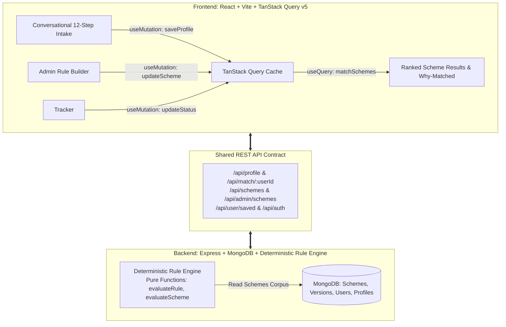
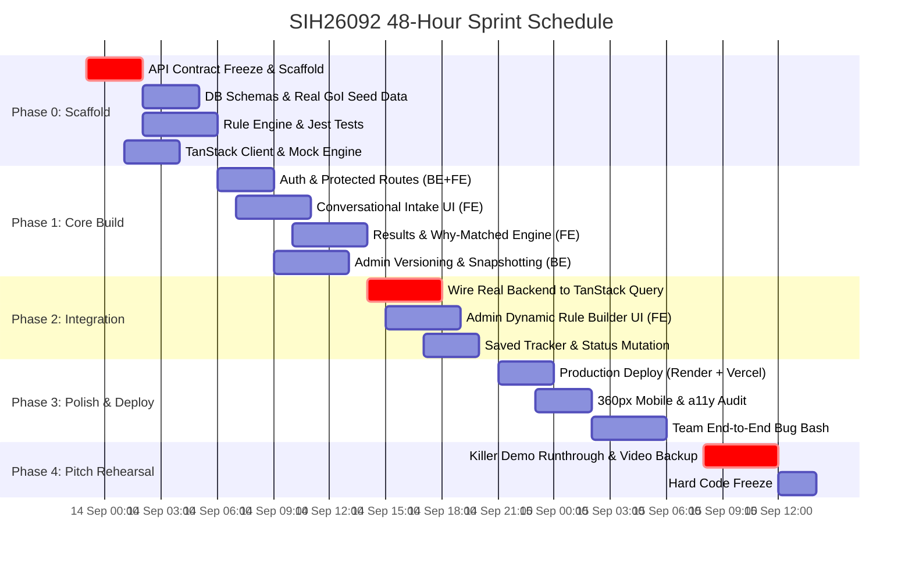

# 🚀 SIH26092 — 48-Hour Production Roadmap & Execution Blueprint
**Project:** AI-Driven Scheme Matching for Marginalized Entrepreneurs (Ministry of Social Justice & Empowerment, GoI)  
**Timeline:** Sept 13 (23:30) → Sept 15 (14:00) | **Target:** Zero-failure live judge demo  
**Architecture:** Node/Express/Mongo (Deterministic Rule Engine) + React/Vite/Tailwind + **TanStack Query v5**

---

## 🧭 Executive Summary & Core Principles



### 3 Non-Negotiable Tenets:
1. **Zero LLM Hallucination for Eligibility:** Eligibility and benefits are strictly evaluated by a pure, deterministic rule engine reading versioned MongoDB corpus.
2. **TanStack Query State Foundation:** All server communication, optimistic saves, offline caching, query invalidation, and mock-to-real switching flow through TanStack React Query v5.
3. **The "Live Proof" Judge Moment:** Admin alters an eligibility threshold on screen, re-evaluates a boundary profile, and the system live-updates match status, demonstrating live schema versioning.

---

## 👥 6-Person Resource & Role Allocation Matrix

| Role | Person | Focus Area & Deliverables |
| :--- | :--- | :--- |
| **BE-Lead** | Dev 1 | Database schemas (Mongoose), Seed script with 15–20 real GoI schemes, MongoDB Atlas setup. |
| **BE-Engine** | Dev 2 | Pure Rule Engine (`evaluateRule`, `evaluateScheme`, `matchAllSchemes`), soft/hard rule logic, Jest tests. |
| **BE-API** | Dev 3 | Express routers, JWT Auth middleware, Admin versioning snapshots (`SchemeVersionHistory`), error shape handler. |
| **FE-Intake** | Dev 4 | Project scaffold, Tailwind setup, `useTranslation` (EN/HI), 12-Step Conversational Intake wizard. |
| **FE-Results** | Dev 5 | TanStack Query client & query keys, Results Page (Ranked Cards, Why-Matched accordion, Checklist), Saved Tracker. |
| **Full-Stack Floater** | Dev 6 | Admin Panel (Dynamic Rule Builder UI), Mock API layer, Vercel/Render CI/CD, 360px mobile audit, demo rehearsal. |

---

## ⚡ TanStack Query v5 Architecture & Query Key Strategy

Using TanStack Query decouples UI components from fetching logic and enables frictionless mock-to-real transitions.

### 1. Unified Query Key Factory (`src/api/queryKeys.js`)
```javascript
export const schemeKeys = {
  all: ['schemes'],
  publicList: () => [...schemeKeys.all, 'public'],
  userMatches: (userId) => [...schemeKeys.all, 'match', userId],
  saved: (userId) => ['user', userId, 'saved'],
  adminList: () => [...schemeKeys.all, 'admin'],
  detail: (schemeId) => [...schemeKeys.all, 'detail', schemeId],
  history: (schemeId) => [...schemeKeys.all, 'history', schemeId],
};
```

### 2. TanStack Query Configuration (`src/api/queryClient.js`)
```javascript
import { QueryClient } from '@tanstack/react-query';

export const queryClient = new QueryClient({
  defaultOptions: {
    queries: {
      staleTime: 1000 * 60 * 5, // 5 minutes fresh
      gcTime: 1000 * 60 * 30,    // Cache retained 30 min
      retry: (failureCount, error) => {
        // Don't retry on 401/403/404
        if (error?.status === 401 || error?.status === 404) return false;
        return failureCount < 2;
      },
      refetchOnWindowFocus: false,
    },
  },
});
```

### 3. Core Hooks to Implement
- `useProfileMutation()`: Handles intake submission, updates cache, redirects to `/results`.
- `useSchemeMatches(userId)`: Fetches ranked matches using `schemeKeys.userMatches(userId)`.
- `useBookmarkScheme()`: Optimistically updates saved list and invalidates `schemeKeys.saved(userId)`.
- `useUpdateSavedStatus()`: Optimistic status mutations (Saved → Applied → Pending → Approved).
- `useAdminSchemeMutation()`: Invalidates `schemeKeys.adminList()` and `schemeKeys.userMatches(userId)` on edit.

---

## ⏱️ Hourly Execution Timeline (Sept 13–15)



---

## 📅 Detailed Phase Breakdown

### Phase 0: Contract Freeze & Engine Core
**Window:** Sept 13, 23:30 → Sept 14, 05:30 (Overnight Sprint)

#### Backend Tasks (Dev 1 & Dev 2):
- [ ] Initialize Express project with clean layered architecture:
  - `/models`, `/routes`, `/controllers`, `/services`, `/middleware`, `/seed`, `/tests`.
- [ ] Mongoose Schemas:
  - `Scheme` (with `eligibilityRules` array: field, operator, value; `benefits` object; `documentsRequired`).
  - `UserProfile` (12 intake fields including SC/ST/OBC, PwD, Transgender, income, collateral).
  - `User` (phone/email, bcrypt password, role).
  - `SavedScheme` & `SchemeVersionHistory`.
- [ ] Seed script (`src/seed/seedSchemes.js`):
  - 16 real GoI schemes populated: **Stand-Up India, PMEGP, MUDRA (Shishu, Kishor, Tarun), PM SVANidhi, National SC/ST Hub, CEGSSC, NSFDC, NBCFDC, NHFDC, SMILE, CGTMSE, Startup India Seed Fund, MP Mukhyamantri Udyami Yojana**.
- [ ] Pure Rule Engine (`src/services/ruleEngine.js`):
  - Pure operators: `eq`, `neq`, `in`, `notIn`, `lte`, `gte`, `lt`, `gt`.
  - Soft vs. Hard rule categorization (e.g., category is hard; income up to +10% is soft partial match).
  - Jest suite: Boundary conditions, missing fields, empty schemes.

#### Frontend Tasks (Dev 4 & Dev 5):
- [ ] Vite + React scaffold with Tailwind CSS & React Router v6.
- [ ] Install dependencies: `@tanstack/react-query`, `lucide-react`, `clsx`, `tailwind-merge`.
- [ ] Configure `QueryClientProvider` at root.
- [ ] Create i18n system (`src/i18n/strings.js`) with English and Hindi dictionary + `useTranslation` hook.
- [ ] Persistent language switcher toggle in header (`EN` / `हिं`).
- [ ] Setup mock API handler matching Section 0 contract gated behind `VITE_USE_MOCKS=true`.

---

### Phase 1: Feature Buildout & UI Implementation
**Window:** Sept 14, 06:00 → Sept 14, 14:00

#### Frontend Conversational Intake (Dev 4):
- [ ] Build `<IntakeStep />` component with step transitions:
  - High accessibility, large tap targets for cheap mobile viewports.
  - Radio card selectors for Category, Gender, Disability, Transgender status.
  - Number inputs with Indian Rupee formatting (`₹`).
  - Progress tracker ("Step 4 of 12") + Back button.
- [ ] Connect final step to TanStack Query mutation (`useProfileMutation`):
  - Posts payload to `/api/profile`, immediately invalidates & fetches `/api/match/:userId`, triggers smooth loading state.

#### Frontend Results & Tracker (Dev 5):
- [ ] Results Page (`/results`):
  - Ranked scheme cards with rank score.
  - Green **Matched** vs. Amber **Close match** badges.
  - Accordion: "Why this matched" (plain-language backend strings, e.g. *"Category: SC/ST ✓"*).
  - "What's missing" accordion for partial matches.
  - Document checklist interactive view.
  - "Save Scheme" button wired to optimistic TanStack mutation.
- [ ] Saved Schemes Tracker (`/tracker`):
  - Status pipeline: `Saved` → `Applied` → `Pending` → `Approved`.
  - TanStack Query mutation updating status on PUT `/api/user/saved/:id`.

#### Backend API & Admin Logic (Dev 3):
- [ ] JWT authentication (`/api/auth/register`, `/api/auth/login`) with `requireAuth` and `requireAdmin`.
- [ ] Core endpoints: `POST /api/profile`, `GET /api/match/:userId`.
- [ ] Admin endpoints with auto-snapshotting to `SchemeVersionHistory` on `PUT /api/admin/schemes/:id`.

---

### Phase 2: Admin Panel & Integration
**Window:** Sept 14, 14:00 → Sept 14, 20:00

#### Admin Panel Screen (Dev 6 - Floater + Dev 3):
- [ ] Admin table with Active/Inactive toggle.
- [ ] Dynamic Rule Builder UI:
  - Add/Remove rule rows: `[Field Selector] [Operator Selector] [Value Input]`.
  - Non-technical friendly UI for ministry officials.
- [ ] Version History Modal:
  - Visual timeline displaying past versions, who changed what, and exact previous eligibility parameters.

#### Parallel Integration & Contract Validation:
- [ ] Flip `VITE_USE_MOCKS=false`.
- [ ] Verify error responses adhere to `{ error: true, message: string, code: string }`.
- [ ] Test real flow: Registration → Intake → Matching Engine → Save → Admin update.

---

### Phase 3: Deployment & Hardening
**Window:** Sept 14, 20:00 → Sept 15, 02:00

- [ ] **Backend Deploy:** Render or Railway with MongoDB Atlas URI.
- [ ] **Frontend Deploy:** Vercel / Netlify with `VITE_API_BASE_URL` pointed at production backend.
- [ ] **Offline & Fault Tolerance:**
  - TanStack Query offline cache demonstration.
  - Global offline banner when `navigator.onLine === false`.
- [ ] **360px Android Viewport Test:**
  - Verify every button, modal, and input at 360x640px.

---

### Phase 4: Bug Bash, Pitch Script & Live Rehearsal
**Window:** Sept 15, 08:00 → Sept 15, 14:00

- [ ] **End-to-End Persona Verification:**
  - Persona A: Rural SC Female Entrepreneur (Stand-Up India + PMEGP match).
  - Persona B: PwD Artisan (NHFDC + PM SVANidhi match).
  - Persona C: Transgender applicant (SMILE scheme match).
  - Persona D: General category above income limit (demonstrates graceful "No Match" & guidance).
- [ ] **The "Killer Live Demo" Rehearsal:**
  1. Show user intake filling in 60 seconds in Hindi.
  2. Instant matching results with plain language explanations.
  3. Switch to Admin panel: edit annual income ceiling from ₹3,00,000 to ₹5,00,000.
  4. Show Version History timeline.
  5. Re-run boundary user: scheme immediately shifts from "Close match" to "Matched"!
- [ ] Record a 3-minute high-definition backup screencast with voiceover.
- [ ] **Hard Code Freeze by 12:00 PM.**

---

## 🛡️ Risk Mitigation Plan

| Risk | Impact | Mitigation Strategy |
| :--- | :--- | :--- |
| **Backend API delayed** | High | Frontend runs 100% on TanStack Query + typed mock fixtures (`VITE_USE_MOCKS=true`). |
| **Network glitch during live demo** | Critical | TanStack Query local cache holds previous queries; record backup video; local fallback script ready on `localhost`. |
| **Judge asks: "Why not use LLM for matching?"** | Pitch Danger | Direct answer: *"Government benefit distribution requires 100% auditable, deterministic legal compliance. LLMs hallucinate eligibility and expose ministries to legal challenges. We use deterministic rule engines for decisions, and plain-language formatting for human clarity."* |
| **Rule Engine boundary error** | High | Unit tests run in Jest on every push covering `<, <=, >, >=` edge cases. |

---

## 📋 Readiness Checklist for Kickoff

- [x] Shared API contract frozen (Section 0)
- [x] Architecture approved (Pure Rule Engine + TanStack Query v5)
- [x] 6-person responsibilities assigned
- [ ] Run `npm create vite@latest frontend -- --template react` in workspace
- [ ] Run `npm init -y` in backend directory
- [ ] Configure MongoDB Atlas cluster connection
